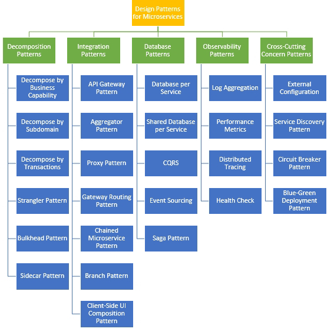
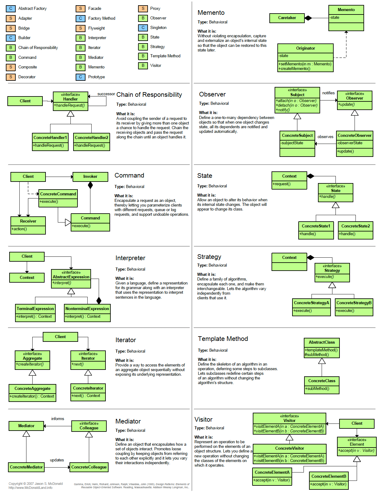
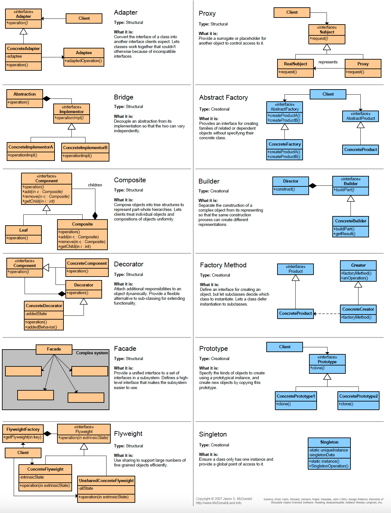

## Adapter (Wrapper) Pattern - Structural [Wiki](https://en.wikipedia.org/wiki/Adapter_pattern)

In software engineering, the adapter pattern is a software design pattern (also known as wrapper, an alternative naming shared with the decorator pattern) that allows the interface of an existing class to be used as another interface. It is often used to make existing classes work with others without modifying their source code.

The adapter design pattern solves problems like:
- How can a class be reused that does not have an interface that a client requires?
- How can classes that have incompatible interfaces work together?
- How can an alternative interface be provided for a class?

Often an (already existing) class can't be reused only because its interface doesn't conform to the interface clients require.
The adapter design pattern describes how to solve such problems:
- Define a separate adapter class that converts the (incompatible) interface of a class (adaptee) into another interface (target) clients require.
- Work through an adapter to work with (reuse) classes that do not have the required interface.

```
public class Cart {
	private List<Item> items;
	public void addItem(Item item) { items.add(item); }
}

public interface IItem {
	string getName();
	double getPrice();
	string getDepartment();
}
public class Banana : IItem {
	string getName() { return "Banana"; }
	double getPrice() { return 4.50; }
	string getDepartment() { return "Fruits"; }
}
public class Stapler : IItem {
	string getName() { return "Stapler"; }
	double getPrice() { return 5.00; }
	string getDepartment() { return "stationery"; }
}

public interface IProduct {
	string getName();
	double getPrice();
	Enum getStore();
}
public class Wheel : IProduct {
	string getName() { return "Wheel"; }
	double getPrice() { return 125.00; }
	Enum getStore() { return Stores.London; }
}

public class ProductAdapter : IItem {
	ProductAdapter(IProduct product) { _product = product; }

	string getName() { return _product.getName(); }
	double getPrice() { return_product.getPrice(); }
	string getDepartment() { return _product.getStore().ToString(); }
}

public static main() {
	var items = List<IItem>() {{
		add( new Banana() );
		add( new Stapler() );
		add( new ProductAdapter(new Wheel()) );
	}};
}
```

## Design patterns cheat sheet  
  

  
  

